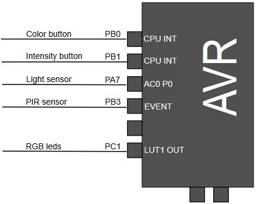

# ATtiny1617 Core Independent Nightlight Using Configurable Custom Logic

This example shows the use of Core Independent Peripherals (CIP), how to use the Configurable Custom Logic (CCL) to filter inputs from different sensors, and how to create specific communication protocols using a Microchip AVR® device, a Passive Infra Red sensor (PIR), Ambient Light Sensor, and 16 addressable RGB LEDs. Many peripherals are configured to work together, independent of the CPU.

The example is explained in more details in the application note [AN2387](https://www.microchip.com//wwwAppNotes/AppNotes.aspx?appnote=en595063)

## Related Documentation

- [AN2387 - Core Independent Nightlight Using Configurable Custom Logic on ATtiny1617](https://www.microchip.com//wwwAppNotes/AppNotes.aspx?appnote=en595063)
- [ATtiny1617 Product Page](https://www.microchip.com/wwwproducts/en/ATtiny1617)

## Software Used

- [Atmel Studio 7.0.2397 or later](https://www.microchip.com/mplab/avr-support/atmel-studio-7)
- ATtiny_DFP 1.5.315 or later
- AVR/GNU C Compiler 5.4.0 (built into studio)

## Hardware Used

-  [ATtiny1617 QFN](https://www.microchip.com/wwwproducts/en/ATtiny1617)
-  [STK600](https://www.microchip.com/developmenttools/ProductDetails/ATSTK600)
-  [STK600 Routing card](https://www.microchip.com/DevelopmentTools/ProductDetails/atstk600-rc103)
-  [STK600 QFN24](https://www.microchip.com/developmenttools/ProductDetails/ATSTK600-SC62)
- Passive Infrared Detector (PIR)
- Ambient Light Sensor - [TEMT6000](http://www.vishay.com/docs/81579/temt6000.pdf) 
- Intelligent Control LED we use a WS2812B-16 board 

## Setup

*   Color Button Connected to `PB0`
*   Intensity Button Connected to `PB1`
*   Ambient Light Sensor Connected to `PA7`
*   PIR Sensor Connected to `PB3`
*   RGB LED Connected to `PC1`

## Operation

1. Download the zip file or clone the example to get the source code.
2. Open `attiny1617-core-independent-night-light-using-ccl-studio.atsln` in Atmel Studio.
3. Connect the ATtiny1617 with your programmer of choice, we used a STK600.
4. In your menu bar in Atmel Studio go to `Debug->Start Without Debugging` or press `CTRL + ALT + F5`.
5. Press one of the buttons or interact with the sensors to wake the AVR and start the processing.

## Conclusion

We have shown how you can make a core independent nightlight using configurable custom logic. This is just one of the many use cases of configurable custom logic.